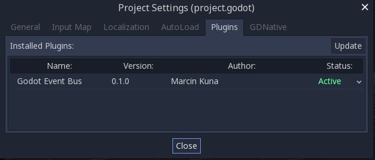
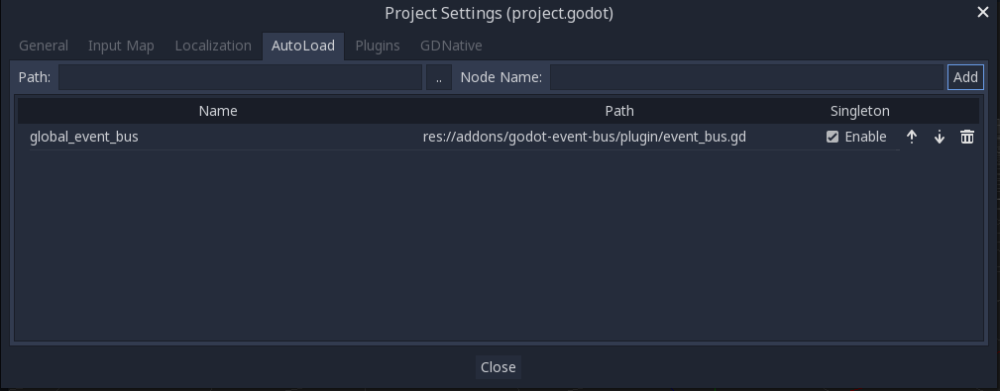
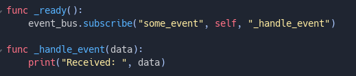
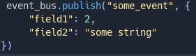
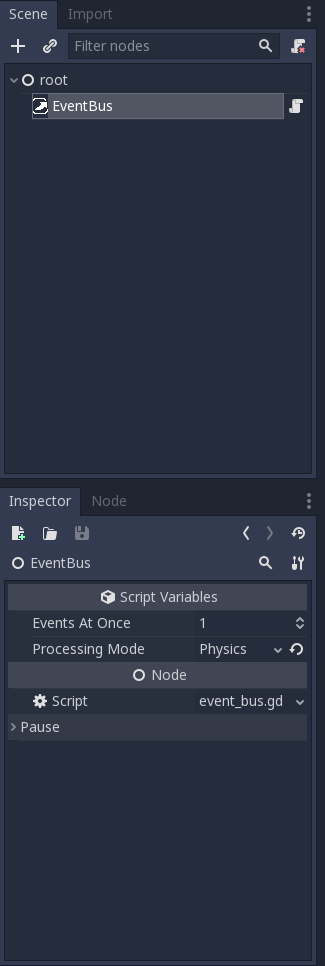

# godot-event-bus
Event Bus implementation for Godot Engine.
Removes the need to explicitly connect signals to nodes - the only thing you need right now is a reference (global or scene-local) to event bus instance and you're good to go!
## Installation 
* Create **addons** directory under root of your Godot project
* Inside **addons** run:
> git submodule add https://github.com/Naata/godot-event-bus
* Or simply unzip contents of this repository inside **addons**
* Enable plugin inside Godot Editor:
 
## Usage
### As global Event Bus
Use event_bus.gd script as Singleton in AutLoad:

### As scene-local Event Bus
Add EventBus node to your scene:

### Send and get some events!
#### Subscribe to event

#### Publish event

## Customize
* You can decide when event processing takes place:
  * **Idle** - inside ```_process(delta)``` function
  * **Physics** - inside ```_physics_process_delta``` function
* Also you can decide how many events will be processed during single invocation (default is 1).

